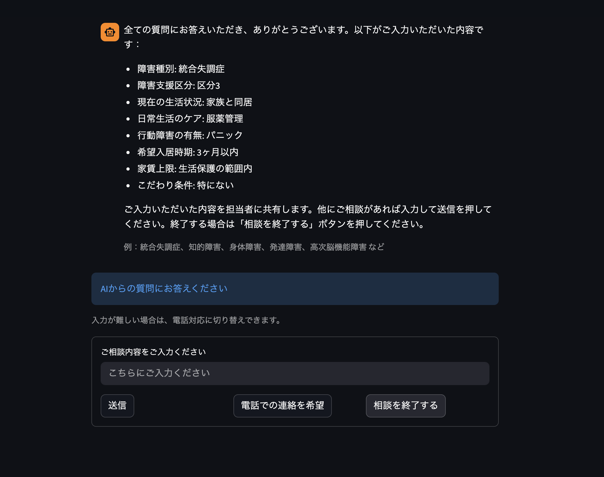
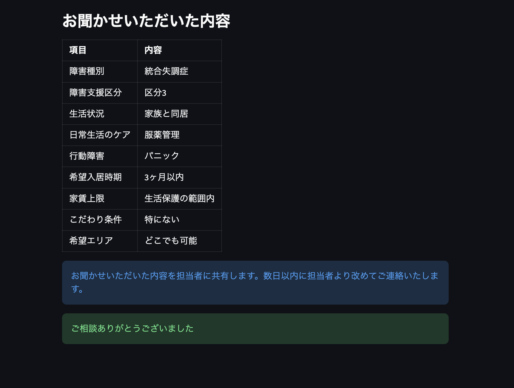
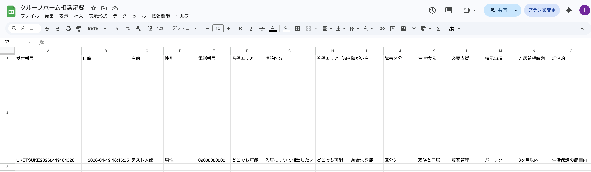

# 福祉業界の入居相談をAIで自動化してみた【Python x Streamlit x OpenAI API x Google Sheets】

**タグ:** Python / Streamlit / OpenAI / 生成AI / 福祉DX

---

## 1. はじめに

福祉業界で働きながら、生成AIエンジニアコースを受講してアプリを作りました。現場の課題を自分で解決したくて。

障害者グループホームへの入居相談は、現場スタッフにとって想像以上に負担の大きい業務です。

- 電話やメールで問い合わせが入るたびに、同じ項目を一から聞き直す
- ヒアリング内容を手書きや口頭でメモし、別途スプレッドシートに転記する
- 担当者が不在だと折り返しが遅れ、相談者を不安にさせてしまう
- 職員によって聞く内容がバラバラで、引き継ぎが困難になる

「聞く→記録する→共有する」の繰り返しは、スタッフのリソースを大きく消耗します。特に小規模な福祉事業所では、相談対応と施設運営を兼務するケースが多い。タイムラグや漏れが発生しやすい状況です。

そこで作ったのが、AIを使った入居相談受付システムです。

**このシステムが実現したこと：**

- **業務の標準化：** AIが毎回同じ手順でヒアリングするため、スタッフの経験やスキルに左右されない
- **担当者不在でも受付継続：** 夜間・休日でもフォームにアクセスするだけで相談を受け付けられる

「初回ヒアリングだけでも自動化できないか？」という発想から、このシステムが生まれました。

---

## 2. 作ったもの

**デモURL**
https://group-home-consultation-ai-demo.streamlit.app

**GitHub**
https://github.com/lifectai/group-home-consultation-ai

**▼ 起動直後の画面：AIが最初の挨拶をして名前を聞く**

**▼ AIが順番に質問しながらヒアリングを進める（← ここで生成AI①を使用）**

**▼ AIが障害種別・支援区分など8項目を自然な会話でヒアリング（← 生成AIが柔軟に対応）**

**アプリの流れ**

1. 相談者がWebフォームにアクセス
2. 名前・性別・電話番号・相談内容を入力
3. AIが順番に質問しながら必要事項（障害種別・支援区分・希望入居時期など）をヒアリング
4. 相談終了時にAIが自動で内容を要約・構造化

**▼ 全項目回答後、AIが9項目を構造化して表示（← 生成AI②③が動作）**

5. Google Sheetsに自動保存 → LINEで担当スタッフに通知

スタッフが対応する前に、必要な情報がすべて整理された状態でスプレッドシートに入っています。

---

## 3. システム構成

| 技術 | 用途 |
|------|------|
| Python | バックエンド全般 |
| Streamlit | WebアプリUI |
| OpenAI API (gpt-4o-mini) | AIヒアリング・要約・情報抽出 |
| Google Sheets (gspread) | 相談記録の保存・管理 |
| LINE Messaging API | スタッフへのリアルタイム通知 |
| pytz | タイムゾーン処理（Asia/Tokyo） |

app.py 1ファイルで完結する構成にしました。Streamlit Cloudにデプロイしているため、サーバー管理も不要です。

---

## 4. なぜこの技術を選んだか

### Streamlit を選んだ理由
- 受講していた生成AIエンジニアコースで学んだ技術だったため、実践的に活かせると判断した
- Pythonだけで完結するため、フロントエンドの知識がなくてもWebアプリが作れる
- Streamlit Cloudを使えばサーバー管理不要でデプロイが簡単で、運用コストも抑えられる

### OpenAI API を選んだ理由
- 信頼性が高く、商用利用での実績も豊富なため安心して採用できる
- 自然言語で相談内容を理解して返答できるため、複雑な分岐ロジックを自前で書く必要がない
- 入居相談は「障害の種類」「家族の状況」「希望時期」など多種多様。ルールベースのチャットボットでは対応しきれない幅広いケースにも柔軟に対応できる

### Google Sheets を選んだ理由
- 担当者がExcelライクに操作できるため、新しいツールへの学習コストが不要
- APIが無料で使えるため、ランニングコストを抑えながら本格的なデータ管理が実現できる
- 多くの人がGoogleに慣れているためアクセスしやすく、現場への導入障壁が低い

---

## 5. 実装のポイント

このアプリで生成AIを使っている箇所は3つです。
- ① AIヒアリング（会話）：OpenAI gpt-4o-mini が相談者と自然な会話をしながら8項目を順番に引き出す
- ② AI要約生成：会話ログ全体をGPTに渡して、スタッフ向けの読みやすい要約文を自動生成
- ③ 情報構造化抽出：会話から障害種別・支援区分・希望時期などをJSON形式で自動抽出

この3つに生成AIを使うことで、「どんな言い方をされても情報を引き出せる」柔軟な相談対応が実現できています。

### Google Sheets 連携

Streamlit Secretsに認証情報を持たせ、@st.cache_resource でクライアントをキャッシュすることで、リロードのたびに再接続しないようにしています。

**▼ 相談完了後、Google Sheetsに自動保存（← 生成AI②③が要約・構造化抽出を実行）**

**▼ 相談完了と同時にスタッフのLINEにリアルタイム通知が届く**

### AIヒアリングの設計

System Promptで「1.障害種別 → 2.支援区分 → ...」の順番を厳密に指定。「未回答の最小番号の項目だけを聞く」ルールを明文化することで、AIが項目を飛ばしたり逆戻りしたりするのを抑制しました。

### AIに空室情報を答えさせない設計

AIに空室情報を回答させないよう意図的に設計しています。空室状況はリアルタイムで変わるため、System Promptで明示的に禁止。AIの役割は「情報を集める」こと。「情報を与える」ことではない。

---

## 6. つまずいたポイント（全記録）

### カテゴリー1：タイムゾーンと環境設定

**（1-1）日本時間（JST）とのズレ**：datetime.now() をそのまま使うとUTCになり9時間ずれる。pytzで明示的にJSTに変換して解決。

**（1-2）ライブラリ不足によるデプロイエラー**：ローカルでは動くのにStreamlit CloudでModuleNotFoundErrorが発生。requirements.txtにライブラリを追加して解決。

### カテゴリー2：データ保存とGoogle Sheets連携

**（2-1）電話番号の先頭「0」が消える**：Google Sheetsが数値認識するため先頭にシングルクォートを付けて文字列として保存。

**（2-2）シートが見つからないエラー**：シート名指定をインデックス指定に変更し、名前変更に左右されない実装に。

**（2-3）データが保存されない**：「相談を終了する」ボタンを追加し、明示的にfinishステップへ遷移させて解決。

### カテゴリー3：APIと認証

**（3-1）Google認証情報のパス問題**：Streamlit Secretsに統一しローカルも.streamlit/secrets.tomlで同形式に。

**（3-2）OpenAI APIキーの無効・設定漏れ**：ローカルの.envとクラウドのSecretsでキーが不一致。両方更新して解決。

**（3-3）APIのクレジット不足**：残高0ドルでエラー。Billing画面からチャージして解決。

**（3-4）レート制限（429エラー）**：リトライ処理を追加し、エラー時はユーザーに「少々お待ちください」と表示。

**（3-5）通信タイムアウト**：timeoutパラメータを設定して再試行するよう対処。

### カテゴリー4：Gitとセキュリティ

**（4-1）APIキーをgitにコミット**：GitHubにpushした瞬間OpenAIから警告メール。git-filter-repoで履歴から削除し.gitignoreに追加。

**（4-2）リポジトリの未初期化**：git initで初期化しリモートリポジトリを追加して解決。

**（4-3）Claude Code APIエラー500**：サーバー側の一時障害でClaude Code経由のgit pushが不可。ターミナルから手動でgit操作して対処。

### カテゴリー5：StreamlitのUIと仕様

**（5-1）セッションステートの管理**：変数をそのまま定義するとリセットされる。st.session_stateで永続化して解決。

**（5-2）意図しない単語変換**：Chromeの自動翻訳で「入居」が「滞在」に。HTMLヘッダに翻訳禁止タグを追加して解決。

**（5-3）チャット画面が自動スクロールしない**：JavaScriptを埋め込む方法で対処。

**（5-4）ログの重複表示**：if not any(...)で同内容チェックしてから追加するよう修正。

### カテゴリー6：コーディングミス

**（6-1）変数のスコープエラー（NameError）**：if文内で定義した変数を外から参照してエラー。事前にデフォルト値で初期化して解決。

**（6-2）インデントの崩れ**：コピペでインデントがずれて動作不良。VSCodeのフォーマット機能（Shift+Alt+F）で解消。

---

## 7. 今後の展望

- **施設マッチング精度向上：** RAGを活用してヒアリング内容をもとに精度の高い施設候補を提示
- **管理画面の整備：** スタッフが相談一覧をアプリ上で確認・対応できる機能
- **マーケティング分析：** 相談内容の割合（料金40%・空室30%など）を可視化して営業戦略に活用
- **FAQ自動生成：** 蓄積した相談ログからよくある質問を自動生成してHPに掲載
- **多言語対応：** 外国籍の利用者向けに英語・中国語での対応を追加
- **音声入力対応：** 文字入力が難しい方へのアクセシビリティ向上
- **Dropbox・Excel連携：** 実務環境への完全移行

---

## 8. おわりに

このシステムを作って一番感じたのは、AIを使って何を作るかより、現場のどの課題を解決するかが重要だということです。技術は手段であって目的ではない。現場を知っているからこそ作れるものがある、と改めて実感しました。

福祉・介護・医療など、同じような繰り返し業務を抱えている現場の方の参考になれば嬉しいです。フィードバックや改善提案もお待ちしています！

**GitHub:** https://github.com/lifectai/group-home-consultation-ai
**デモ:** https://group-home-consultation-ai-demo.streamlit.app
